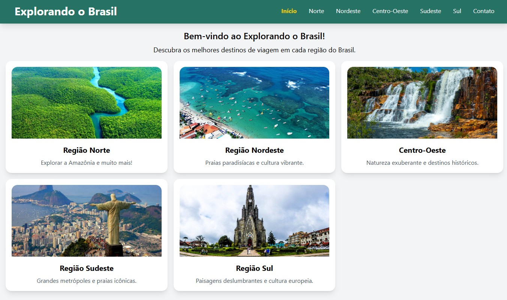
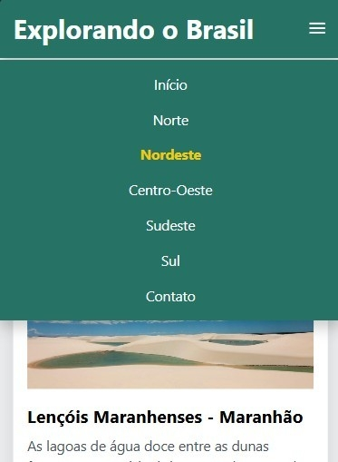

# Explorando o Brasil 🌎

Projeto desenvolvido na disciplina de **Construção de Sites II** do Curso Técnico em Informática do **IFS** (Instituto Federal de Sergipe). O objetivo deste projeto é explorar e apresentar as belezas e diversidades do Brasil, com um site interativo e responsivo que destaca as cinco regiões brasileiras.

---

## 🚀 Tecnologias Utilizadas

Este projeto foi desenvolvido com as seguintes tecnologias:

- **HTML**: Estruturação do conteúdo da página.
- **CSS**: Estilização personalizada, complementando o Tailwind CSS.
- **Tailwind CSS**: Framework de utilidades para agilizar o desenvolvimento e garantir um design responsivo.
- **JavaScript**: Interatividade e funcionalidades dinâmicas, como validação de formulário e menu mobile.

---

## 🛠️ Como Executar o Projeto

Siga os passos abaixo para rodar o projeto localmente:

1. **Clone o repositório**:

   ```bash
   git clone https://github.com/Igorx26/ExplorandoOBrasil.git
   ```

2. **Acesse a pasta do projeto e abra o arquivo index.html**

## 🎨 Design e Funcionalidades

### 📱 Design Responsivo

O projeto foi desenvolvido com **Tailwind CSS**, garantindo um **layout responsivo** que se adapta a diferentes dispositivos (**desktop, tablet e mobile**).

- O menu de navegação é escondido em dispositivos móveis e exibido ao clicar no ícone de menu (`menuIcon`).

### ⚡ Interatividade

- **Menu Mobile**: Utiliza JavaScript (`menuIcon.js`) para alternar a visibilidade do menu em dispositivos móveis.
- **Validação de Formulário**: Na página de contato, o JavaScript (`formValidate.js`) valida se os campos de **nome, e-mail e mensagem** foram preenchidos corretamente.

### 🎨 Estilos Personalizados

O arquivo `global.css` contém estilos personalizados, como:

- Classe `.ativo` para destacar o link da página atual.
- Estilos para o **menu mobile** e **navbar**.

### 📸 Capturas de Tela

**Página inicial do site:**  


**Imagem da página da região Sul:**  


**Imagem do menu mobile:**  


### 📄 Licença

Este projeto está sob a licença **MIT**. Consulte o arquivo `LICENSE` para mais detalhes.
